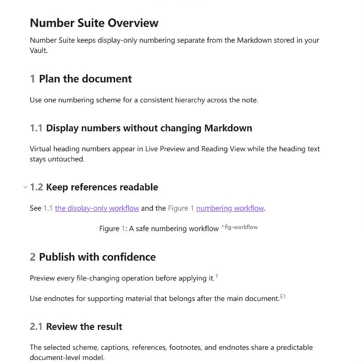
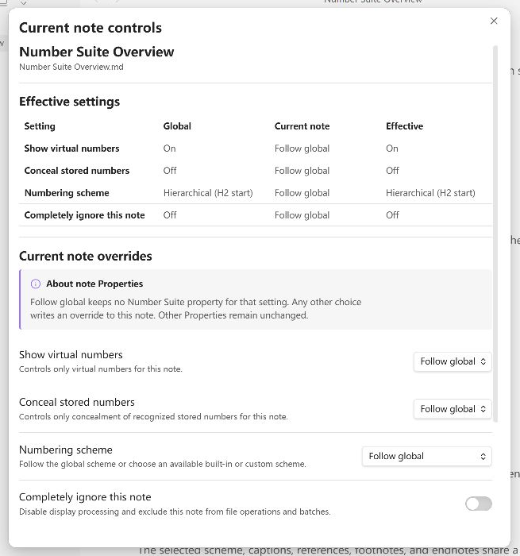
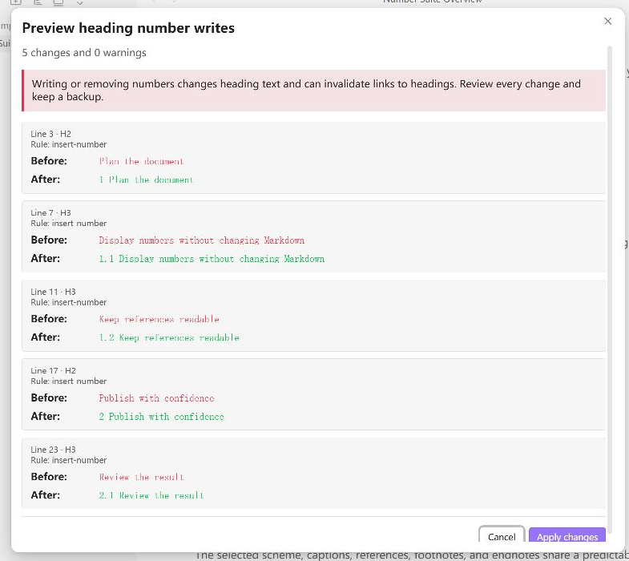

# Number Suite

[English](../../README.md) · [简体中文](README.zh-CN.md)

Number Suite 将 Markdown 工具经常混在一起的两个决定分开：标题序号是否写入 Markdown
文件，以及这些序号是否在 Obsidian 中可见。它可以写入、移除、虚拟显示或视觉隐藏标题
序号，不访问网络，也不收集遥测。

<!-- section: screenshots -->
## 界面截图

### 纯显示文档编号

同时查看虚拟标题序号、题注编号、同文件引用、脚注和尾注，不修改 Markdown 源文件。



### 侧栏中的当前笔记控制

在 Number Suite 侧栏的“当前笔记”选项卡中，对比全局默认值、按笔记覆盖值和最终生效值。



### 安全的文件操作预览

Number Suite 写入 Markdown 前，逐项检查修改前后内容和全部警告。



<!-- section: features -->
## 功能

- 在实时预览和阅读视图中显示计算序号，不修改 Markdown。
- 视觉隐藏可靠识别的实体序号，同时保持源文件不变且可访问。
- 同时启用虚拟显示和隐藏，将一个可靠识别的实体前缀替换为计算序号。
- 预览后对当前笔记执行写入、清理或重新编号。
- 通过内容过期保护、有界恢复数据和冲突安全回滚处理文件夹或整个库。
- 使用层级数字、中文公文和法律条文内置方案。
- 创建多个自定义方案，使用经过校验的 H1-H9 模板，并保留历史模板用于清理。
- 使用精确的 7、8 或 9 个井号源码行作为与 DocWen 兼容的 H7-H9 扩展标题。
- 使用 Number Suite 文档大纲查看 H1-H9 标题及 Figure、Table、Equation、Code 题注，点击
  条目可跳到对应源码行。
- 精确排除单个标题或整个标题子树，且不占用序号。
- 将 `Figure:`、`Table:`、`Equation:` 和 `Code:` 题注显示为实心胶囊；可选的虚拟编号
  在每个 Markdown 文件内按四种类型分别从 1 开始。
- 可分别设置四种题注是否居中；Figure 和 Equation 默认居中，Table 和 Code 默认跟随
  当前主题。
- 可分别把四种绑定题注显示在对象上方或下方；Markdown 源码始终把题注保存在对象上方。
- 悬停图片或对应 Figure 图题时，以图题为标题、替换文字为内容显示结构化提示。
- 将显式同文件标题、完整题注名和稳定块引用显示为可交互的描边胶囊；目标有编号时带编号，
  没有编号也能显示。
- 可在标题或题注的右键菜单中复制稳定交叉引用：复用已有块 ID，或在创建新 ID 前先预览。
- 为 `[^id]`、`[^footnote:id]` 和 `[^endnote:id]` 显示脚注 `1、2、3` 与尾注
  `E1、E2、E3`；重复引用复用首次编号。
- 按笔记覆盖显示、隐藏、方案、清理范围、起始值，或完全退出插件处理。
- 使用英文或简体中文界面。

<!-- section: requirements-and-compatibility -->
## 要求与兼容性

- Obsidian `1.12.7` 或更高版本。
- 支持桌面版和 Android 版 Obsidian；移动端以 Android 15 / API 35 作为基准验收环境。
- 当前未验证 iOS 行为。

<!-- section: installation -->
## 安装

### 第三方插件市场

在 Obsidian 中打开**设置 → 第三方插件 → 浏览**，搜索 **Number Suite**，安装并启用。
如果当前目录中尚未显示，请按下文手动安装。

### 手动安装

从同一个 GitHub Release 下载 `main.js`、`manifest.json` 和 `styles.css`，将三个文件放入
`.obsidian/plugins/number-suite/`，然后重新加载 Obsidian 并启用插件。不要混用不同
版本的文件。

<!-- section: usage -->
## 使用方法

| 源文件状态 | 期望结果 | 操作 | 是否修改 Markdown |
|---|---|---|---|
| 没有实体序号 | 只在 Obsidian 中显示 | 开启虚拟序号 | 否 |
| 没有实体序号 | 保存计算序号 | 写入标题序号 | 是 |
| 已有实体序号 | 只在界面隐藏 | 开启隐藏 | 否 |
| 已有实体序号 | 替换为计算显示序号 | 同时开启虚拟序号和隐藏 | 否 |
| 已有实体序号 | 从文件移除 | 清理标题序号 | 是 |

隐藏功能只有一套全局识别规则：可以仅识别带 Number Suite 来源标记的序号，也可以识别匹配
已知内置、当前自定义及历史方案模板的序号。单篇笔记只能覆盖隐藏、显示或跟随全局，不能
暗中扩大识别范围。

功能区图标打开常驻右侧栏。“文档大纲”选项卡显示 Number Suite 的 H1-H9 标题和题注；
“当前笔记”选项卡提供按笔记显示、方案和文件操作。“打开当前笔记控制面板”命令会直接
选中后一个选项卡。文件修改仍会另外弹出预览，确认前不会应用。写入或移除序号会改变标题
文本，可能使 `[[笔记#标题]]`、标题嵌入或外部锚点失效；插件不会猜测并重写这些链接。

### H7-H9 扩展标题

Number Suite 与 DocWen 共享一套明确的 Word 7～9 级标题扩展：行首精确写 7、8 或 9 个
`#`，随后至少一个空白字符。10 个及以上井号仍是普通文本。扩展标题参与编号、起始值、重置、
排除、写入、Live Preview、阅读视图，以及只读的 `number-suite.interop.v2` 消费者快照。

H7-H9 不是 Obsidian/CommonMark 原生标题层级，因此 Obsidian 内置大纲、反向链接、标题路径
导航和其他原生标题索引可能无法识别；Number Suite 自己的侧栏大纲会显示这些层级，并按源码
行跳转。互通与引用时建议写入稳定块 ID，例如 `######## 深层主题 ^deep-topic`。需要阅读视图
增强时，每个扩展标题应单独成段，并在前后留空行。纯显示使用始终以 Markdown 源码为准且
不修改源码。

题注与交叉引用显示从不写入 Markdown。题注必须是以 `Figure:`、`Table:`、`Equation:` 或
`Code:` 精确开头的顶层段落；`Listing:` 不是兼容别名。识别出的整条题注显示为实心胶囊，
可选编号位于胶囊内部。普通 `[[#...]]` 链接完全交由 Obsidian。
题注关键词只决定语义标签和编号系列，相邻的独立块决定实际承载结构。因此任意题注类型都可
绑定图片、Markdown 表格、块公式或围栏代码块；例如 `Figure:` 可为包含多张图片的表格提供图题，
而表格仍保持原生表格结构。零个或一个空行可绑定，两个空行解除绑定；两侧都有候选对象或同一对象
有多个候选题注时失败关闭。未绑定题注仍继续编号、显示胶囊并可被交叉引用。
题注对齐独立于题注编号。Figure 和 Equation 默认居中；可在“题注”选项卡中分别调整四种
固定题注类型。
每种类型还可以单独选择视觉上位于“对象上方”或“对象下方”，四种类型均默认在上方。题注与
对象之间的小间距只属于显示效果，切换位置不会改写文件。Live Preview 中光标进入题注时，胶囊
消失，并在规范源码位置显示完整的 `Figure: ... ^id`；编辑某个交叉引用时，也只展开该引用自身
的 `@[[...]]` 源码。

在编辑模式中，可右键独占一行的 `![[image.png]]` 或 `` 图片添加 Figure
图名；右键顶层 Markdown 表格任意一行添加 Table 表名；右键独立 `$$...$$` 块公式添加
Equation 公式名；右键顶层围栏代码块添加 Code 代码名。操作使用真实右键目标，图片不需要先被
选中。如果 Live Preview 中的表格已由 Structural Tables 接管，同一个表名操作也会加入它的
渲染表格右键菜单，普通表格接管和多行表头结构表格都适用；两个插件只安装其中任意一个时也会
各自正常工作。

弹窗会先预览将写入的精确 Markdown 行，再通过一次有界编辑器事务执行。所有新题注都存放在
对象上方；紧邻图片下方的旧 Figure 题注会提供有界的“移到上方”操作。如果相邻关键词仅大小写
有误（例如 `figure:`），同一操作会修正它，而不是插入重复题注。已有精确题注、笔记嵌入、行内
图片、行内公式、行内代码，以及表格单元格里的图片/公式/代码都不会出现独立题注操作；交叉引用
仍可写在单元格里。创建题注本身绝不会创建块 ID。

“显示图片与图题悬停提示”默认开启。悬停绑定 Figure 的图片或图题，都会看到渲染图题及有效的
Wiki 替换文字或 Markdown alt；两者相同时只显示一次，文件名和 `500`、`500x300` 尺寸值不会
制造提示。行内或单元格图片可以只显示替换文字，但仍不能拥有独立 Figure 题注。

### 同文件交叉引用

打开 **设置 → Number Suite → 交叉引用**，开启**显示同文件交叉引用**。在同文件目标链接
前加上 `@`。标题名唯一时可直接引用标题；题注名唯一时可用包含固定类型的完整题注名引用。
目标有编号时会带上编号，但关闭标题序号和题注编号后，引用胶囊仍然显示。

```markdown
## 安装

请参见 @[[#安装]] 或 @[[#安装|安装章节]]。

Figure: 系统架构 ^fig-architecture

请参见 @[[#Figure: 系统架构]] 或 @[[#^fig-architecture|系统架构图]]。
```

如果标题显示为 `1`、题注显示为 `Figure 1: 系统架构`，以上引用胶囊分别显示为
`1 安装`、`1 安装章节`、`Figure 1: 系统架构` 和 `Figure 1: 系统架构图`。关闭编号后，
这些引用仍是胶囊，只是不再带编号。标题的虚拟序号使用紧凑实心胶囊，题注目标使用实心
胶囊，交叉引用使用可交互描边胶囊，因此目标与链接不只依赖颜色区分。

可读的手写引用使用 `@[[#标题]]`，或使用 `@[[#Figure: 系统架构]]` 这样的完整题注名。
标题名和题注名在同一个文件内共同消歧；精确目标为零或多个时保持原样。不带固定类型的名称
只按标题解析。以后编辑造成重名时，Number Suite 不会自动改写已有题名引用。

需要稳定引用时，在标题或题注上右键选择**复制交叉引用**。目标已有块 ID 时会直接复用并
复制；没有时先预览一个有界 Markdown 改动，确认后才创建 ID。题注 ID 追加在题注行末，标题
ID 使用合法的下一行独立块 ID，然后复制带可读别名的链接。这是题注与交叉引用流程中唯一会
创建 ID 的显式操作。普通 `[[#...]]` 链接、跨文件链接和缺失或有歧义的目标保持原样。

### 脚注与尾注

类型化注释显示同样不修改 Markdown。`[^id]` 和 `[^footnote:id]` 属于脚注，显示为
`1、2、3`；`[^endnote:id]` 属于尾注，显示为 `E1、E2、E3`。两种计数器在每个文件内分别
从 1 开始，并按首次引用顺序编号；重复引用复用首次编号。

“脚注与尾注”设置选项卡可以让 Live Preview 保留原始标记，或用格式化编号替换。采用
格式化编号时，单击显示编号或把光标移到编号处，即可展开并编辑实体标记。阅读模式继续保留
带编号的原生跳转。定义缺失、重复、冲突或渲染不匹配时保持 Obsidian 原样。采用两个空格
缩进的多行注释正文不会进入标题、题注或语义引用扫描。

<!-- section: settings -->
## 设置

所有受支持的 Obsidian 版本统一使用一套无障碍七选项卡设置界面：常规、标题编号、题注、
交叉引用、脚注与尾注、写入与清理、显示与批处理。页签本身已经表明当前分区，因此内容区
直接从第一个控件或说明开始；只有题注位置、题注对齐、外观和批处理等真正的下级功能组才显示标题。

### 序号方案

模板使用 `{标题层级.数字格式}` 占位符，例如 `{1.arabic}` 或 `{2.chinese_lower}`。支持
阿拉伯数字、全角阿拉伯数字、中文小写/大写、带圈数字、拉丁字母大写/小写和罗马数字
大写/小写。

空的 Hn 模板不输出序号，但该标题仍属于结构：它会增加本层计数、重置更深层计数，并可由
后代模板引用。非空 Hn 模板必须包含 Hn 占位符，且不能引用更深层级。编号核心以方案模板
作为逐层规则。模板必须为单行、不能以空白开头，也不能包含 HTML 注释或 U+2060 来源标记。
裸字母或罗马数字计数器必须带明确分隔符，例如 `{1.letter_lower}.`，否则会被拒绝。

自定义方案可以精确排除逻辑标题。排除整个子树会跳过标题及其全部后代；仅排除标题时，后代
采用所选的跨级策略。排除不支持模糊匹配或正则表达式。

### 清理与来源标记

清理预览先采用已保存的默认范围，并允许为本次操作选择来源标记、已知模板或更宽的常见
人工序号范围。默认会保留有歧义的小数、版本号、年份、日期和单位数量前缀。

可选的 U+2060 来源标记可精确标识插件写入的序号。它属于实验功能且默认关闭，因为不可见
字符可能影响互操作、复制文本和标题链接。专用命令可以移除标记而保留可见序号。

### 按笔记 Properties 覆盖

侧栏的“当前笔记”选项卡显示全局值、覆盖值和最终生效值。未修改的笔记不会得到插件 Properties。
将控制项改回“跟随全局”会删除对应属性；“全部恢复”会移除全部 Number Suite 覆盖，
并保留无关 Properties。

```yaml
---
number-suite:
  - heading.virtual=true
  - heading.hide-stored=true
  - heading.scheme=hierarchical-h2
  - heading.first-number.h2=3
  - heading.skip-first.h2=2
---
```

`heading.first-number.h2=3` 表示第一个参与编号的 H2 显示 3，并不是跳过标题。
`heading.skip-first.h2=2` 表示前两个非空 H2 不参与编号，且不消耗计数器。
使用 `number-suite: [disabled=true]` 可让当前笔记退出显示和文件操作。清理范围不属于笔记
元数据，应在每次清理或重编号预览中选择。

旧版 Number Suite Properties 仍可读取。在“当前笔记”中明确修改一次时，插件才会把该笔记
迁移为规范列表，并且只移除旧版 Number Suite 字段。新旧等价值可同时读取；冲突、重复指令、
未知指令、无效值或不可用方案都会安全阻止显示和写入。

<!-- section: limitations -->
## 限制

- 一个 Markdown 文件只有一套最终生效的序号方案，不支持章节局部切换方案。
- 题注计数和语义引用解析也以单个 Markdown 文件为作用域。嵌入文件使用自己的源码和计数；
  不识别跨文件语义引用。
- 脚注和尾注采用彼此独立的文件级计数器。注释锚点、导航、布局和定义渲染仍由 Obsidian
  管理；插件只改变经过校验的可见标签。
- 处理顶层 ATX H1-H6，以及 Number Suite/DocWen 的 H7-H9 扩展标题。Setext 标题、块引用、
  列表、注释、frontmatter、围栏代码和 HTML 块都不是编号目标；Obsidian 原生标题索引仍以
  宿主自身支持的语法为准。
- 不支持 Canvas、Obsidian 内置大纲、Backlinks、Search Results 或 PDF 导出集成；Number
  Suite 提供自己的 H1-H9 与题注侧栏大纲。
- Source Mode 装饰默认关闭，使实体 Markdown 始终直接可见。
- 阅读视图隐藏只改变可见文本，不改变标题 DOM `id`；锚点仍跟随实体标题。
- 如果第三方渲染器改变标题数量或层级，阅读视图会对该区块失败关闭。

<!-- section: privacy-and-security -->
## 隐私与安全

Number Suite 完全在本地运行，不包含联网、遥测、分析、广告、远程字体或远程资源。虚拟
显示和视觉隐藏路径不会调用文件写入 API。

打开批处理工具时，Number Suite 会枚举 Vault 的文件夹树和 Markdown 文件列表，以筛选
用户选择的范围、排除已配置的文件夹，并在写入前生成精确预览。

当前笔记修改使用一次编辑器事务。批处理会预览全部目标、重新校验精确内容、保存有界恢复
数据，并避免覆盖并发编辑。这些保护能够降低风险，但不能说明适合直接在普通或正式 Vault
中进行首次验收。验收应使用隔离测试 Vault。

请通过 [GitHub Security Advisories](../../SECURITY.md) 报告安全或数据丢失问题，不要附带
私有 Vault 内容。

<!-- section: development -->
## 开发

使用 Node.js `24.19.0` 和 npm `11.17.0`。

```bash
npm ci
npm run check
```

项目文档：

- [产品需求](../product-requirements.zh-CN.md)
- [UX 规格](../ux-spec.zh-CN.md)
- [架构](../architecture.zh-CN.md)
- [测试策略](../testing-strategy.zh-CN.md)
- [发布流程](../release.zh-CN.md)

项目链接：

- [贡献指南](../../CONTRIBUTING.md)
- [安全策略](../../SECURITY.md)
- [变更记录](../../CHANGELOG.md)

<!-- section: support -->
## 支持

请通过 [GitHub Issues](https://github.com/ZHYX91/obsidian-number-suite/issues) 报告可复现问题
或提出功能建议。请提供插件和 Obsidian 版本、操作系统、最小化的合成 Markdown、所选方案及
精确操作。不要附带私有 Vault 内容。

<!-- section: license -->
## 许可证

[MIT](../../LICENSE)
